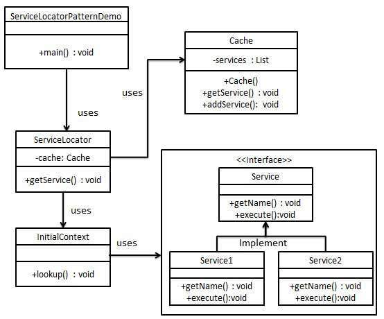

# Software Design Patterns
Example Software Design Pattern With Spring Boot

## Creational Patterns
These design patterns provide ways to create objects while hiding the creation logic, instead of instantiating objects directly using the new operator. This gives the program more flexibility in deciding which objects need to be created for a given use case. - GoFPatterns

### Simple Factory Pattern
Simple Factory pattern is one of the most used design patterns in Java. This type of design pattern comes under creational pattern as this pattern provides one of ***the best ways to create an object.***

In Simple Factory pattern, we create object without exposing the creation logic to the client and refer to newly created object using a common interface.

Example

Reference:
https://www.tutorialspoint.com/design_pattern/factory_pattern.htm

### Factory Method Pattern

Factory Method is to creating objects as Template Method is to implementing an algorithm. A superclass specifies all standard and generic behavior (using pure virtual "placeholders" for creation steps), and then delegates the creation details to subclasses that are supplied by the client.

Factory Method makes a design more customizable and only a little more complicated. Other design patterns require new classes, whereas Factory Method only requires a new operation.

Factory Method is similar to Abstract Factory but without the emphasis on families.

Reference:
https://sourcemaking.com/design_patterns/factory_method

### Abstract Factory Pattern
Abstract Factory is a creational design pattern that lets you produce families of related objects without specifying their concrete classes.

Example

Reference:
https://refactoring.guru/design-patterns/abstract-factory

### Builder Pattern
Builder is a creational design pattern that lets you construct complex objects step by step. The pattern allows you to produce different types and representations of an object using the same construction code.

Example

Reference:
https://refactoring.guru/design-patterns/builder

### Singleton Pattern
Singleton pattern is one of the simplest design patterns in Java. This type of design pattern comes under creational pattern as this pattern provides one of the best ways to create an object.

This pattern involves a single class which is responsible to create an object while making sure that only single object gets created. This class provides a way to access its only object which can be accessed directly without need to instantiate the object of the class.

Example

Reference:
https://www.tutorialspoint.com/design_pattern/singleton_pattern.htm

### Prototype Pattern

Prototype is a creational design pattern that lets you copy existing objects without making your code dependent on their classes.

Reference:
https://refactoring.guru/design-patterns/prototype

## Structural Patterns
These design patterns deal with class and object composition. The concept of inheritance is used to compose interfaces and define ways to compose objects to obtain new functionality. - GoFPatterns

### Adapter Pattern

Adapter is a structural design pattern that allows objects with incompatible interfaces to collaborate.

Reference:
https://sourcemaking.com/design_patterns/adapter

### Facade Pattern

Facade is a structural design pattern that provides a simplified interface to a library, a framework, or any other complex set of classes.

Example

Reference:
https://refactoring.guru/design-patterns/facade

### Decorator Pattern

Decorator is a structural design pattern that lets you attach new behaviors to objects by placing these objects inside special wrapper objects that contain the behaviors.

Example

Reference:
https://refactoring.guru/design-patterns/decorator

### Proxy Pattern

Proxy is a structural design pattern that lets you provide a substitute or placeholder for another object. A proxy controls access to the original object, allowing you to perform something either before or after the request gets through to the original object.

Example

Reference:
https://refactoring.guru/design-patterns/proxy

### Bridge Pattern

Bridge is a structural design pattern that lets you split a large class or a set of closely related classes into two separate hierarchies—abstraction and implementation—which can be developed independently of each other.

Example

Reference:
https://refactoring.guru/design-patterns/bridge

## Behavioral Patterns
These design patterns are specifically concerned with communication between objects. - GoFPatterns

### Observer Pattern

Observer is a behavioral design pattern that lets you define a subscription mechanism to notify multiple objects about any events that happen to the object they’re observing.

Example

Reference:
https://refactoring.guru/design-patterns/observer

### Strategy Pattern

Strategy is a behavioral design pattern that lets you define a family of algorithms, put each of them into a separate class, and make their objects interchangeable.

Example

Reference:
https://refactoring.guru/design-patterns/strategy

### Command Pattern
Command pattern is a data driven design pattern and falls under behavioral pattern category. A request is wrapped under an object as command and passed to invoker object. Invoker object looks for the appropriate object which can handle this command and passes the command to the corresponding object which executes the command.

Example

Reference:
https://www.tutorialspoint.com/design_pattern/command_pattern.htm

### Template Method Pattern
In Template pattern, an abstract class exposes defined way(s)/template(s) to execute its methods. Its subclasses can override the method implementation as per need but the invocation is to be in the same way as defined by an abstract class. 

Example

Reference:
https://www.tutorialspoint.com/design_pattern/template_pattern.htm

## Architectural patterns
An architectural pattern is a general, reusable solution to a commonly occurring problem in software architecture within a given context. Architectural patterns are similar to software design patterns but have a broader scope. The architectural patterns address various issues in software engineering, such as computer hardware performance limitations, high availability and minimization of a business risk. Some architectural patterns have been implemented within software frameworks. - Wikipedia

### Service Locator Pattern
The service locator design pattern is used when we want to locate various services using JNDI lookup. Considering high cost of looking up JNDI for a service, Service Locator pattern makes use of caching technique. For the first time a service is required, Service Locator looks up in JNDI and caches the service object. Further lookup or same service via Service Locator is done in its cache which improves the performance of application to great extent.

Example

Reference:
https://www.tutorialspoint.com/design_pattern/service_locator_pattern.htm

